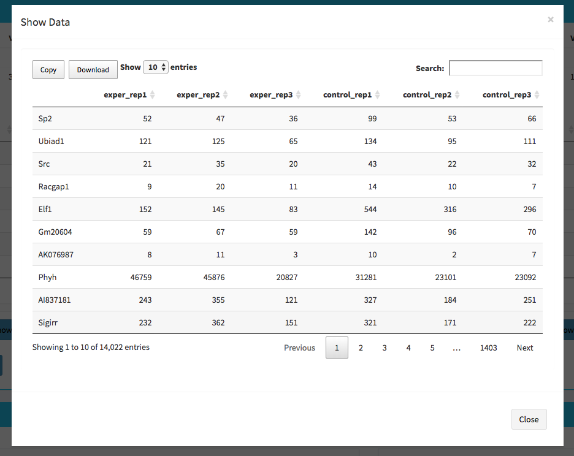
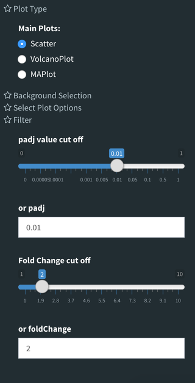
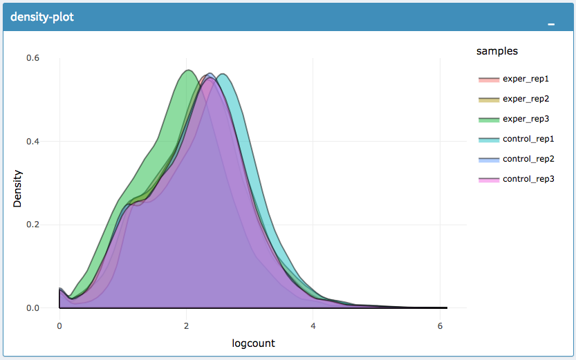

*****************
Quick-start Guide
*****************

This guide is walkthrough for the DEBrowser from start to finish.

Getting Started
===============

First off, we need to head to the DEBrowser webpage at this url::

	https://debrowser.umassmed.edu/

Alternatively, if you have the R package installed, you can call these R commands::

	library(debrowser)
	startDEBrowser()

.. tip::

	For more information on installing DEBrowser locally, please consult our `Local Install Guide <http://debrowser.readthedocs.io/en/latest/local/local.html>`_.

Once you've made your way to the website, or you have a local instance of DEBrowser running, you will be greeted with data loading section:

.. image:: ../debrowser_pics2/data_load.png
	:align: center

To begin the analysis, you need to upload your *count data file* (comma or semicolon separated (CSV), and tab separated (TSV) format) to be analyzed and choose appropiate separator for the file (comma, semicolon or tab). 

If you do not have a dataset to upload, you can use the built in demo data file by clicking on the 'Load Demo (Vernia et al.)!' button.  To view the entire demo data file, you can download
this `demo set`_.  For an example case study, try our `advanced demo`_.

.. _demo set: https://bioinfo.umassmed.edu/pub/debrowser/simple_demo.tsv

.. _advanced demo: https://bioinfo.umassmed.edu/pub/debrowser/advanced_demo.tsv

The structure of the count data files are shown below:

=====  =====  =====  =====  =====  =====
gene   trans   exp1   exp2  cont1  cont2
=====  =====  =====  =====  =====  =====
DQ714  uc007   0.00   0.00   0.00   0.00
DQ554  uc008   0.00   0.00   0.00   0.00
AK028  uc011   2.00   1.29   0.00   0.00
=====  =====  =====  =====  =====  =====

.. tip::

	DEBrowser also accepts count data files via hyperlink, for more information please see the `autoload data via hyperlink <quickstart.html#autoload-data-via-hyperlink>`_ section.

In addition to the count data file; you need to upload metadata file to correct for batch effects or any other normalizing conditions you might want to address that might be within your results. To handle for these conditions, simply create a metadata file by using the example table at below or download sample file from `this link <https://raw.githubusercontent.com/onuryukselen/debrowser/develop/docs/quickstart/metadata.tsv>`_.

============  ========  =========
sample        batch     condition
============  ========  =========
exper_rep1    1         A
exper_rep2    2         A
exper_rep3    1         A
control_rep1  2         B
control_rep2  1         B
control_rep3  2         B
============  ========  =========

Metadata file can be formatted with comma, semicolon or tab separators similar to count data files. These files used to establish different batch effects for multiple conditions.
You can have as many conditions as you may require, as long as all of the samples are present. 

.. note::

    The example above would result in the first set of conditions as ``exper_rep1``, ``exper_rep2``, ``exper_rep3`` from ``A`` and second set of conditions as ``control_rep1``, ``control_rep2``, ``control_rep3`` from ``B`` as they correspond to those conditions in the ``condition`` column.

    In the same way, 'batch' would have the first set as ``exper_rep1``, ``exper_rep3``, ``control_rep2`` from ``1`` and second set as ``exper_rep2``, ``control_rep1``, ``control_rep3`` from ``2`` as they correspond to those conditions in the ``batch`` column.

Once the count data and metadata files have been loaded in Debrowser, you can click upload button to visualize your data as shown at below:

.. image:: ../debrowser_pics2/upload_summary.png
	:align: center
	
After loading the gene quantification file, and if specified the metadata file containing your batch correction fields, you then have the option to filter low counts and conduct batch effect correction prior to your analysis. Alternatively you may skip these steps and directly continue with differential expression analysis or view quality control (QC) information of your dataset.

Low Count Filtering
===================

In this section, you can simultaneously visualise the changes of your dataset while filtering out the low count genes. Choose your filtration criteria from **Filtering Methods** box which is located at the center of the screen. Three methods are available to be used:

	* **Max:** Filters out genes where maximum count for each gene across all samples are less than defined threshold. 
	* **Mean:** Filters out genes where mean count for each gene are less than defined threshold. 
	* **CPM:**	First, counts per million (CPM) is calculated as the raw counts divided by the library sizes and multiplied by one million. Then it filters out genes where at least defined number of samples is less than defined CPM threshold.

After selection of filtering methods and entering threshold value, you can proceed by clicking **Filter** button which is located just bottom part of the **Filtering Methods** box. On the right part of the screen, your filtered dataset will be visualized for comparison as shown at figure below. 

.. image:: ../debrowser_pics2/filtering.png
	:align: center
	:width: 99%

You can easily compare following features, before and after filtering: 

	* Number of genes/regions.
	* Read counts for each sample.
	* Overall histogram of the dataset.
	* gene/region vs data of samples 

.. important::

	To investigate the gene/region vs data of samples in detail as shown at below, you may click the **Show Data** button, located bottom part of the data tables. Alternatively, you may download all filtered data by clicking **Download** button which located next to **Show Data** button.  

Afterwards, you may continue your analysis with **Batch Effect Correction** or directly jump to differential expression analysis or view quality control (QC) information of your dataset.

Batch Effect Correction and Normalization
=========================================
If specified metadata file containing your batch correction fields, then you have the option to conduct batch effect correction prior to your analysis. By adjusting parameters of **Options** box, you can investigate your character of your dataset. These parameters of the options box are explained as following:

	* **Normalization Method:** DEBrowser allows performing normalization prior the batch effect correction. You may choose your normalization method (among MRN (Median Ratio Normalization), TMM (Trimmed Mean of M-values), RLE (Relative Log Expression) and upperquartile), or skip this step by choosing **none** for this item. For our sample data, we gonna choose MRN normalization.
	* **Correction Method:** DEBrowser uses `ComBat <https://bioconductor.org/packages/release/bioc/vignettes/sva/inst/doc/sva.pdf>`_ (part of the SVA bioconductor package) or `Harman <https://www.bioconductor.org/packages/3.7/bioc/vignettes/Harman/inst/doc/IntroductionToHarman.html>`_ to adjust for possible batch effect or conditional biases. For more information, you can visit following links for documentation: `ComBat <https://bioconductor.org/packages/release/bioc/vignettes/sva/inst/doc/sva.pdf>`_, `Harman <https://www.bioconductor.org/packages/3.7/bioc/vignettes/Harman/inst/doc/IntroductionToHarman.html>`_ For our sample data, Combat correction was selected.
	* **Treatment:** Please select the column that is specified in metadata file for comparision, such as cancer vs control. It is named *treatment* for our sample metadata.
	* **Batch:** Please select the column name in metadata file which differentiate the batches. For example in our metadata, it is called *batch*.

Upon clicking submit button, comparison tables and plots will be created on the right part of the screen as shown below. 

.. image:: ../debrowser_pics2/batch_PCA.png
	:align: center
	:width: 99%
	
.. image:: ../debrowser_pics2/batch_IQR.png
	:align: center
	:width: 99%
	
.. image:: ../debrowser_pics2/batch_density.png
	:align: center
	:width: 99%

You can investigate the changes on the data by comparing following features:

	* Read counts for each sample.
	* PCA, IQR and Density plot of the dataset.
	* Gene/region vs samples data
	
.. tip:: 
	
	You can investigate the gene/region vs samples data in detail by clicking the **Show Data** button, or download all corrected data by clicking **Download** button.
    
Since we have completed **batch effect correction and normalization** step, we can continue with one of the following options: 'Go to DE Analysis' and ,'Go to QC plots!'. First option takes you to page where differential expression analyses are conducted with DESeq2, EdgeR or Limma. The second option, 'Go to QC plots!', takes you to a page where you can view quality control metrics of your data by PCA, All2All, Heatmap, Density, and IQR plots.

DE Analysis
===========
The first option, 'Go to DE Analysis', takes you to the next step where differential expression analyses are conducted. 

    * **Sample Selection:** In order to run DE analysis, you first need to select the samples which will be compared. To do so, click on "Add New Comparison" button, and choose **Select Meta** box as **treatment** to simplify fill ``Condition 1`` and ``Condition 2`` based on the **treatment** column of the metadata as shown below.  

        .. image:: ../debrowser_pics2/de_selection.png
	       :align: center

    If you need to remove samples from a condition, simply select the sample you wish to remove and hit the delete/backspace key. In case, you need to add a sample to a condition you can click on one of the condition text boxes to bring up a list of samples and then click on the sample you wish to add from the list and it will be added to the textbox for that comparison. 

    .. tip::
    
        You can add multiple conditions to compare by clicking on "Add New Comparison" button, and view the results seperately after DE analysis.

    * **Method Selection:** Three DE methods are available for DEBrowser: DESeq2, EdgeR, and Limma. DESeq2 and EdgeR are designed to normalize count data from high-throughput sequencing assays such as RNA-Seq. On the other hand, Limma is a package to analyse of normalized or transformed data from microarray or RNA-Seq assays. We have selected DESeq2 for our test sample and showed the related results at below.

After clicking on the 'Submit!' button, DESeq2 will analyze your comparisons and store the results into seperate data tables. It is important to note that the resulting data produced from DESeq is normalized. Upon finishing the DESeq analysis, a result table will appear which allows you to download the data by clicking "Download" button. To visualize the data with interactive plots please click on "Go to Main Plots!" button.

The Main Plots of DE Analysis
=============================

Upon finishing the DESeq analysis, please click on **Go to Main Plots!** button which will open **Main Plots** tab where you will be able to view
the interactive plots. 

.. image:: ../debrowser_pics/info_tabs.png
	:align: center

The page will loads with **Scatter Plot**. You can switch to **Volcano Plot** and **MA Plot** by using **Plot Type** section at the left side of the menu. Since these plots are interactive, you can click to **zoom** button on the top of the graph and select the area you would like to zoom in by drawing a rectangle. Please see the plots at below:

    .. image:: ../debrowser_pics2/example_main_plots.png
       :align: center
       :width: 99%
    
**A.** Scatter plot, **B.** Volcano plot, **C.** MA plot

.. tip::

    Please keep in mind that to increace the performance of the generating graph, by default 10% of non-significant(NS) genes are used to generate plots. You might show all NS genes by please click **Main Options** button and change Background Data(%) to 100% on the left sidebar.
    
    .. image:: ../debrowser_pics2/example_background_data.png
       :align: center
       :width: 30%

You can hover over the scatterplot points to display more information about the point selected. A few bargraphs will be generated for the user to view as soon as a scatterplot point is hovered over.

.. image:: ../debrowser_pics2/main_plot_hover.png
	:align: center
	:width: 99%
    
**A.** Hover on Fabp3 gene, **B.** Read Counts vs Samples, **C.** Read Counts vs Conditions

You also have a wide array of options when it comes to fold change cut-off levels, padj cut-off values, which comparison set to use, and dataset of genes to analyze.

.. tip::

    It is important to note that when conducting multiple comparisons, the comparisons are labeled based on the order that they are input. If you don't remember which samples are in your current comparison you can always view the samples in each condition at the top of the main plots.

    .. image:: ../debrowser_pics2/selected_conditions.png
	   :align: center

After DE analysis, you can always download the results in CSV format by clicking the **Download Data** button located under the **Select Plot Options**. You can also download the plot or graphs by clicking on the **download** button at top of each plot or graph.

The Heatmap of DE Analysis
==========================

Once you've selected a specific region on Main Plots (Scatter, Volcano or MA plot), a new heatmap of the selected area will appear just next to your plot. If you want to hide some groups (such as Up, Down or NS based on DE analysis), just click on the group label on the top right part of the figure. In this way, you can select a specific part of the genes by **lasso select** or **box select** tools that includes only **Up** or **Down** Regulated genes. As soon as you completed your selection, heatmap will be created simultaneously. Please find details about heatmaps on `Heatmaps <./../heatmap/heatmap.html>`_ section. 

.. image:: ../debrowser_pics2/main_plot_selection.png
	:align: center
	:width: 99%
    
**A.** Box Selection, **B.** Lasso Selection, **C.** Created heatmap based on selection

.. tip::

    We strongly recommend normalization before plotting heatmaps. To normalize, please change the parameters that are located under: **Select Plot options -> Normalization Methods** and select the method from the dropdown box.

GO Term Plots
=============

The next tab, 'GO Term', takes you to the ontology comparison portion of
DEBrowser.  From here you can select the standard dataset options such as
p-adjust value, fold change cut off value, which comparison set to use, and
which dataset to use on the left menu.  In addition to these parameters, you
also can choose from the 4 different ontology plot options: 'enrichGO',
'enrichKEGG', 'Disease', and 'compareCluster'.  Selecting one of these plot
options queries their specific databases with your current DESeq results.

.. image:: ../debrowser_pics/go_plots_opts.png
	:align: center

Your GO plots include:

* enrichGO - use enriched GO terms
* enrichKEGG - use enriched KEGG terms
* Disease - enriched for diseases
* compareClusters - comparison of your clustered data

The types of plots you will be able to generate include:

Summary plot:

.. image:: ../debrowser_pics/go_summary.png
	:align: center

GOdotplot:

.. image:: ../debrowser_pics/go_dot_plot.png
	:align: center

Changing the type of ontology to use will also produce custom parameters for that specific ontology at the bottom of the
left option panel.

Once you have adjusted all of your parameters, you may hit the submit button in the top right and then wait
for the results to show on screen!

Data Tables
===========

The lasttab at the top of the screen displays various different data tables.
These datatables include:

* All Detected
* Up Regulated
* Down Regulated
* Up+down Regulated
* Selected scatterplot points
* Most varied genes
* Comparison differences

.. image:: ../debrowser_pics/datatable.png
	:align: center

All of the tables tables, except the Comparisons table, contain the following information:

* ID - The specific gene ID
* Sample Names - The names of the samples given and they're corresponding tmm normalized counts
* Conditions - The log averaged values
* padj - padjusted value
* log2FoldChange - The Log2 fold change
* foldChange - The fold change
* log10padj - The log 10 padjusted value

The Comparisons table generates values based on the number of comparisons you have conducted.
For each pairwise comparison, these values will be generated:

* Values for each sample used
* foldChange of comparison A vs B
* pvalue of comparison A vs B
* padj value of comparison A vs B

.. image:: ../debrowser_pics/comparisons.png
	:align: center

You can further customize and filter each specific table a multitude of ways.  For unique table or dataset options, select the type of
table dataset you would like to customize on the left panel under 'Choose a dataset' to view it's additional options.
All of the tables have a built in search function at the top right of the table and you can further sort the table
by column by clicking on the column header you wish to sort by.  The 'Search' box on the left panel allows for multiple searches via
a comma-seperated list.  You can additionally use regex terms such as "^al" or "\*lm" for even more advanced searching.
This search will be applied to wherever you are within DEBrowser, including both the plots and the tables.

.. tip::
    
    If you enter more than three lines of genes, search tool will automatically match the beginning and end of the search phrases. Otherwise it will find matched substrings in the gene list.
    

----

You can also view specific tables of your input data for each type of dataset available and search for a specific geneset
by inputting a comma-seperated list of genes or regex terms to search for in the search box within the left panel.
To view these tables, you must select the tab labeled 'Tables' as well as the dataset from the dropdown menu on the left panel.

.. tip::

    If you ever want to change your parameters, or even add a new set of comparisons, you can always return to the *Data Prep* tab to change and resubmit your data. 

Quality Control Plots
=====================

Selecting the 'QC Plots' tab will take you to the quality control plots section.  The page opens with a Principal Component Analysis (PCA) plot and users can also view a All2All, heatmap, IQR, and density by choosing **Plot Type** in the left panel. Here the dataset being used in the plots, depends on the parameters you selected in the left panel. Therefore, you are able to adjust the size of the plots under 'width' and 'height' as well as alter a variety of other parameters to adjust the specific plot you're viewing. 

The All2All plot displays the correlation between each sample, Heatmap shows a heatmap representation of your data, IQR displays a barplot displaying the IQR between samples, and Density will display an overlapping density graph for each sample. You also have the ability to select the type of clustering and distance method for the heatmap produced to further customize your quality control measures. Users also have the option to select which type of normalization methods they would like to use for these specific plotting analysis within the left menu.

.. image:: ../debrowser_pics2/intro_sidebar.png
	:align: center
	:width: 30%

Ploting Options

.. image:: ../debrowser_pics2/intro_qc_all2all.png
	:align: center

All2All Plot

.. image:: ../debrowser_pics2/intro_qc_heatmap.png
	:align: center
    
Heatmap Options to Normalize All Detected Data and Created Heatmap 

.. image:: ../debrowser_pics2/intro_qc_pca.png
	:align: center

PCA Plot

    
PCA Loadings

.. image:: ../debrowser_pics2/iqr_plot.png
	:align: center
    
IQR Plot Before Normalization
    
.. image:: ../debrowser_pics2/iqr_plot_norm.png
	:align: center
    
IQR Plot After Normalization

Density Plot Before Normalization

Density Plot After Normalization

.. note::

    Each QC plot also has options to adjust the plot height and width, as well as a download button for a png output located above each plot.

For the Heatmap, you can also view an interactive session of the heatmap by selecting the 'Interactive' checkbox before submitting your
heatmap request.  Make sure that before selecting the interactive heatmap option that your dataset being used is 'Up+down'.
Just like in the Main Plots, you can click and drag to create a selection. To select a specific portion of the heatmap, make sure
to highlight the middle of the heatmap gene box in order to fully select a specific gene.  This selection can be used later within the
GO Term plots for specific queries on your selection. For find more details please click `Heatmaps <./../heatmap/heatmap.html>`_ section. 

.. image:: ../debrowser_pics2/interactive_heatmap.png
	:align: center
	:width: 99%

A. Before Selection B. Selection of area with zoom tool C. Zoomed heatmap region which allows better viewing resolution.

Saving the State
================

After the file upload is complete and a pair of conditions are selected, "Save Selection!"
button should appear on the sidebar on the left. If you click this button, you will be able
to name your save and access it later with the name you choose. There are certain limitations
on the naming, but you will be given an error message to make the necessary correction as it is
based on bookmarking functionality of Shiny.

Your new save will appear as a clickable link under "New Save:" and as you make more saves, those
will be available under "History:" after refreshing the page. Only the last 20 saves will appear
for better user interface, so it is advisable to delete the unused saves by clicking "X" icon.

Google Login
============

If you start up the shiny server using startDEBrowser(), you will automatically be logged in as 'local'.
However, if you use the runApp() command to start the server, you'll be asked to log in using a
Google account. This is to ensure the past saves correspond to the right person. You can log in using
any Google account, and then give permission to the DEBrowser to log in for the first time.

Once you are done using DEBrowser, you can either choose to stay logged in for your next use or sign out
to stop access to your account. In order to sign out, click on the gear icon on the top right corner and
then click on "Sign Out". If you want to start over from the beginning while staying logged in, you can
click on "Refresh" to go back to the beginning. You will still be able to access your save history when
you sign out or refresh.

Autoload Data via Hyperlink
===========================

DEBrowser also accepts TSV's via hyperlink by following conversion steps. First, using the API provided by Dolphin, we will convert TSV into an html represented TSV using this website::

	https://dolphin.umassmed.edu/public/api/

The two parameters it accepts (and examples) are:

	1. source=https://bioinfo.umassmed.edu/pub/debrowser/advanced_demo.tsv
	2. format=JSON

Leaving you with a hyperlink for::

	https://dolphin.umassmed.edu/public/api/?source=https://bioinfo.umassmed.edu/pub/debrowser/advanced_demo.tsv&format=JSON

Next you will need to encode the url so you can pass it to the DEBrowser website.
You can find multiple url encoders online, such as the one located at `this
link. <https://www.url-encode-decode.com/>`_.

Encoding our URL will turn it into this::

	http%3A%2F%2Fdolphin.umassmed.edu%2Fpublic%2Fapi%2F%3Fsource%3Dhttp%3A%2F%2Fbioinfo.umassmed.edu%2Fpub%2Fdebrowser%2Fadvanced_demo.tsv%26format%3DJSON

Now this link can be used in debrowser as::

	https://debrowser.umassmed.edu:443/debrowser/R/

It accepts two parameters::

	1. jsonobject= http%3A%2F%2Fdolphin.umassmed.edu%2Fpublic%2Fapi%2F%3Fsource%3Dhttp%3A%2F%2Fbioinfo.umassmed.edu%2Fpub%2Fdebrowser%2Fadvanced_demo.tsv%26format%3DJSON
	2. title= no

The finished product of the link will look like this::

	https://debrowser.umassmed.edu:443/debrowser/R/?jsonobject=https://dolphin.umassmed.edu/public/api/?source=https://bioinfo.umassmed.edu/pub/debrowser/advanced_demo.tsv&format=JSON&title=no

Inputting this URL into your browser will automatically load in that tsv to be analyzed by DEBrowser!

